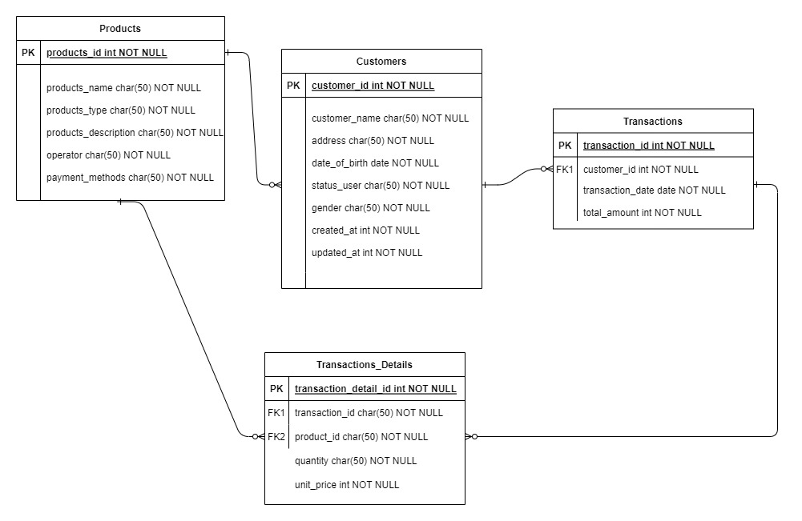
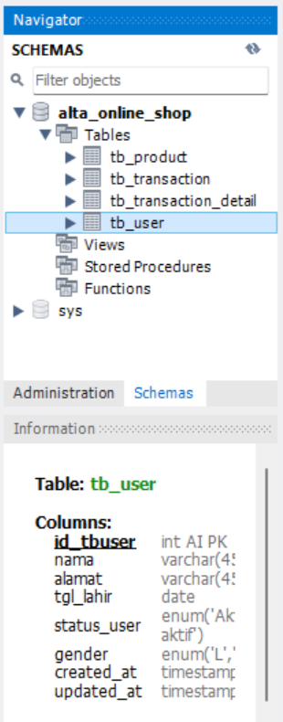
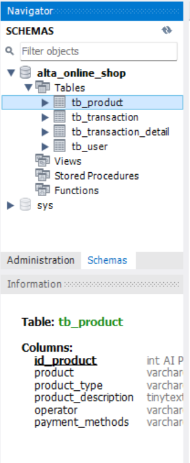
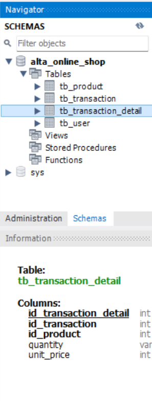
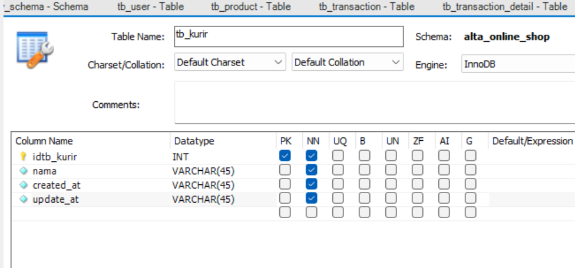
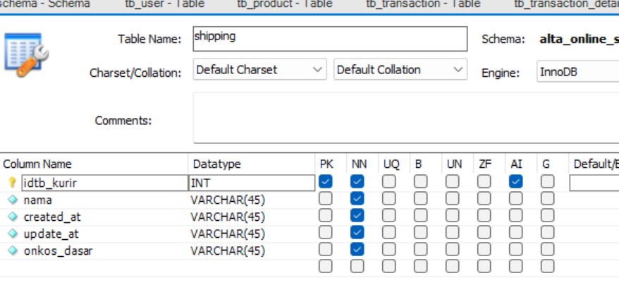
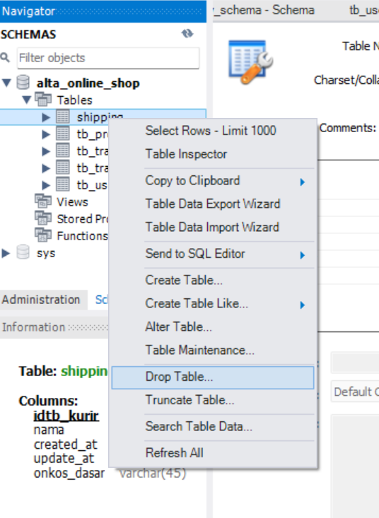
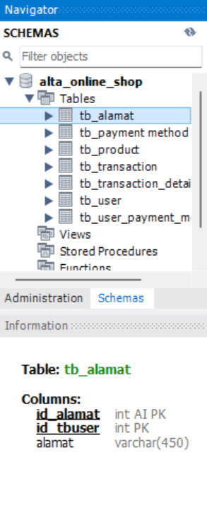
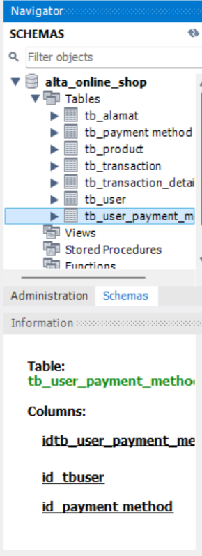

Merancang Skema Database
1. Buatlah rancangan skema database dengan kriteria sebagai berikut:
    a. Sistem dapat menyimpan data mengenai detail item product, yaitu : product, product_type,             product_description, operator, payment_methods.
    b. Sistem juga harus menyimpan data mengenai pelanggan yang akan membeli product tsb diantaranya : nama, alamat, tanggal lahir, status_user, gender, created_at, updated_at.
    c. Sistem dapat mencatat transaksi pembelian dari pelanggan.
    d. Sistem dapat mencatat detail transaksi pembelian dari pelanggan.
Gunakan draw.io atau lucidchart untuk membuat ERD.

Data Definition Language (DDL)
1. Create database alta_online_shop.

2. Dari schema Olshop yang telah kamu kerjakan di, Implementasikanlah menjadi table pada MySQL.
    Create table user.

    Create table product, product type, operators, product description, payment_method.

    Create table transaction, transaction detail.

3. Create tabel kurir dengan field id, name, created_at, updated_at.

4. Tambahkan ongkos_dasar column di tabel kurir.

5. Rename tabel kurir menjadi shipping.

6. Hapus / Drop tabel shipping karena ternyata tidak dibutuhkan.

7. Silahkan menambahkan entity baru dengan relation 1-to-1, 1-to-many, many-to-many. Seperti:
    1-to-1: payment method description.

    1-to-many: user dengan alamat.

    many-to-many: user dengan payment method menjadi user_payment_method_detail.
